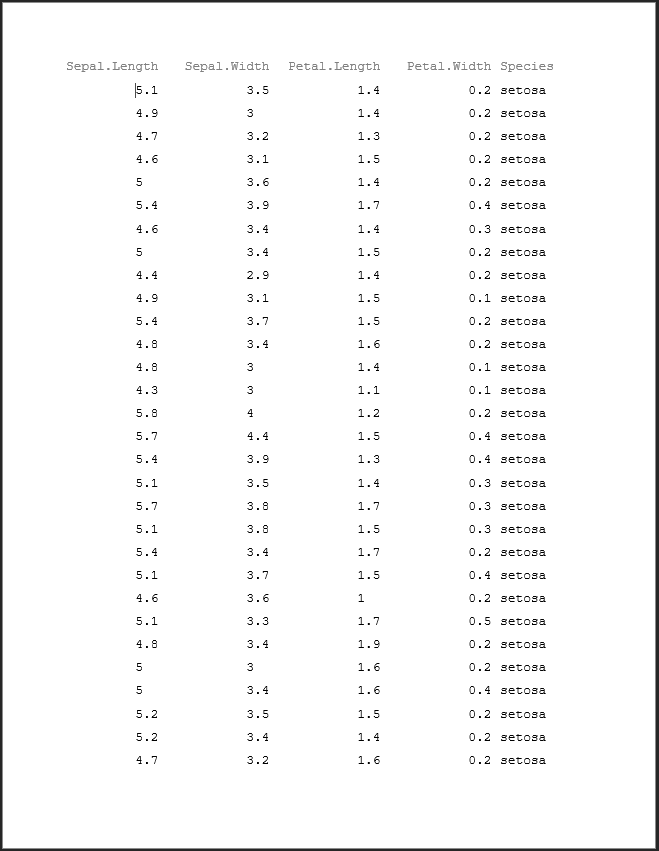
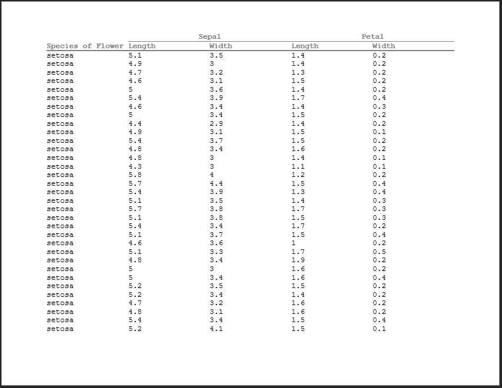
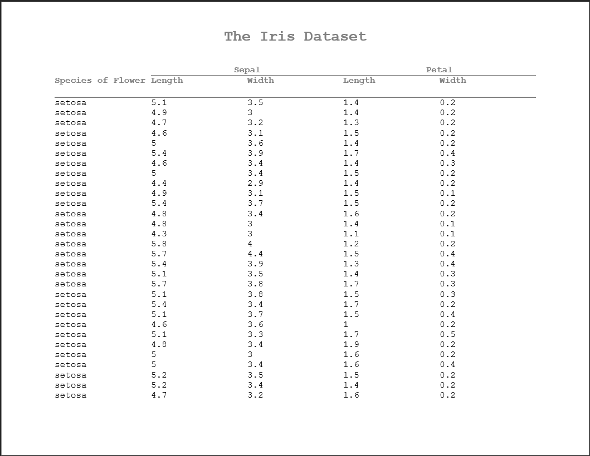
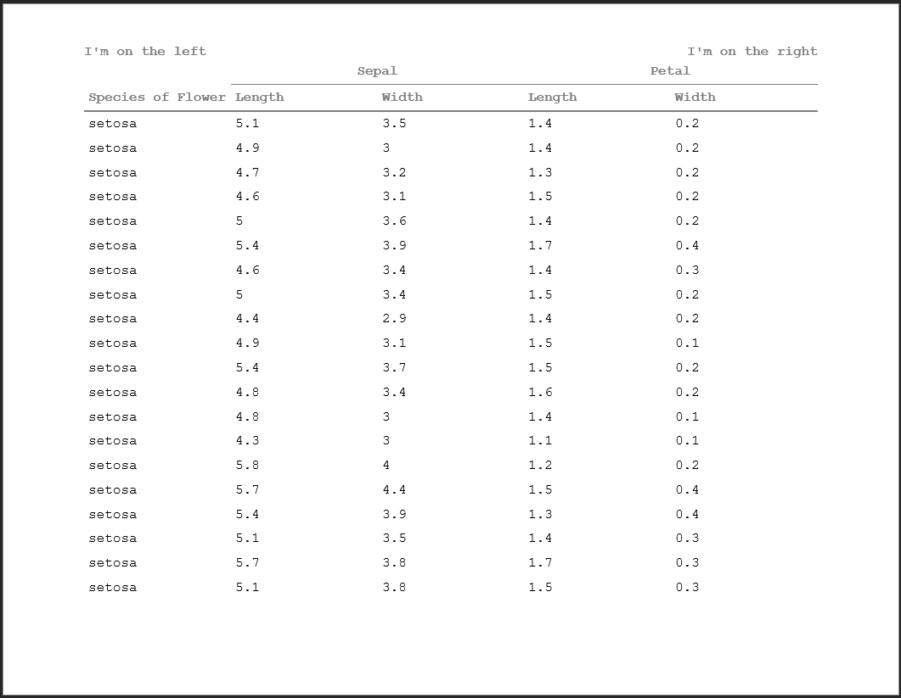
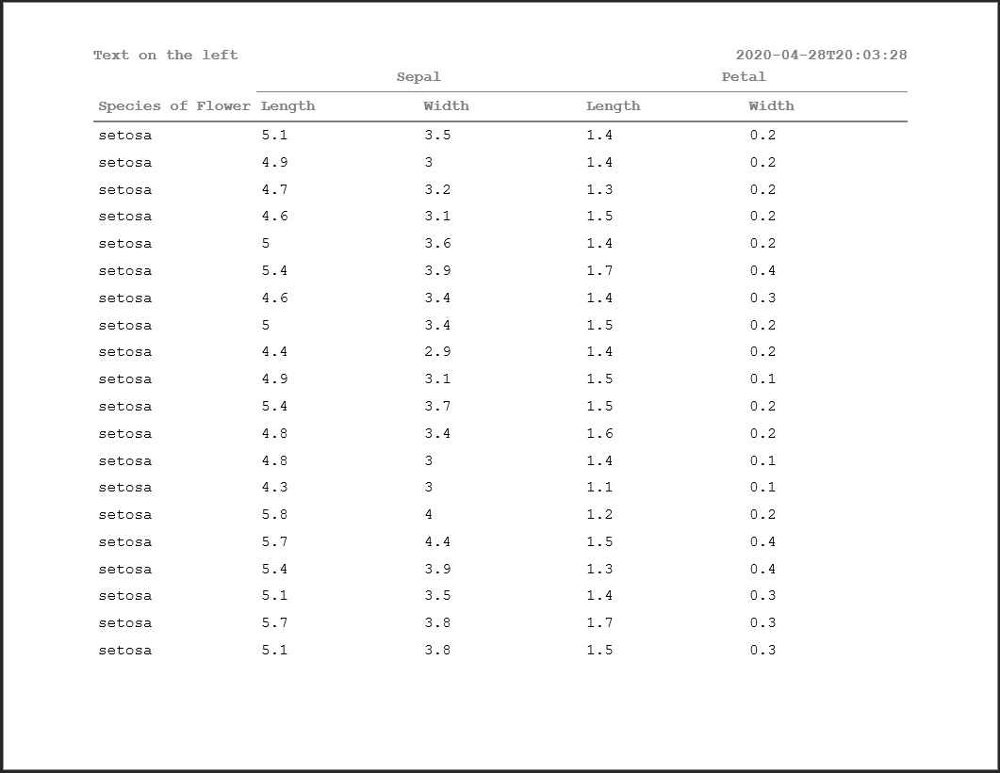
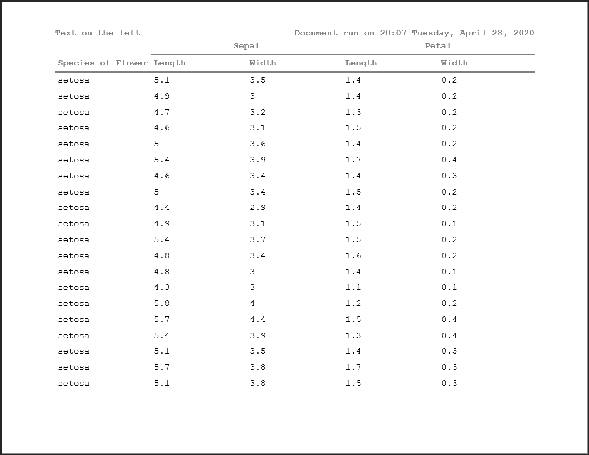
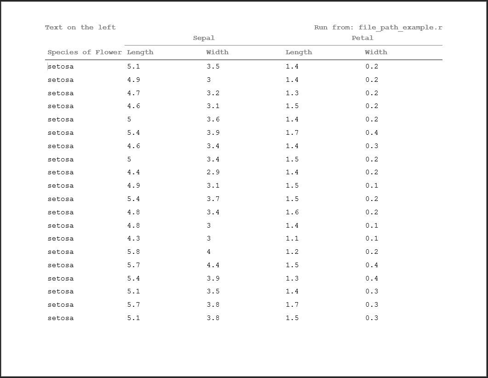

```{r setup, include = FALSE}
knitr::opts_chunk$set(
  collapse = TRUE,
  comment = "#>"
)

library(tidyverse)
library(pharmaRTF)
```

## Introduction

This vignette will focus on a few more intricate features of the pharmaRTF package. After reviewing this document, you should have a good idea of how to get the most out of pharmaRTF. Specifically, this vignette covers:

- Understanding document orientation within pharmaRTF
- Multi-level column headers
- Minimizing cell padding
- Setting spacing between column headers and titles
- Split titles
- Special titles/footnote formats

## A Small Note

Some of the syntax we use throughout this document uses the `%>%` pipe operator. This is to display support for a tidyverse style of coding. You can find the `%>%` operator in the [magittr](https://cran.r-project.org/package=magrittr/vignettes/magrittr.html) package.

## Understanding Document Orientation Within pharmaRTF

In development of this feature, we realized as a team that the orientation of an RTF document has a bit of room for confusion. This spawns from the fact that within Microsoft Word, orientation is automatically determined by the document height and width, despite there being a keyword within RTF syntax that specifies landscape orientation. That said, we believe the most intuitive way to set the orientation of a document is with a property function, which in pharmaRTF is simply `orientation`/`set_orientation`. 

The default orientation of a `pharmaRTF` document is landscape, as this is typically what you would use on the clinical reports that the package is designed for. `orientation` is closely tied with the `page_size` attribute. When the orientation of an `rtf_doc` object is set to landscape, the height and width of the `pagesize` attribute will write out as specified in the object, with `height` writing to the height document property and `width` writing to the width property. 


```{r orientation1}
ht <- huxtable::as_hux(iris, add_colnames=TRUE) %>% 
  huxtable::set_width(1.2)

doc <- rtf_doc(ht)
pagesize(doc)

```

When you switch the orientation to 'portrait', the height and width properties will not change. Rather, when the actual RTF document is written out, the height and width will be reversed, effectively flipping the document on its side. 

```{r orientation2}
doc <- rtf_doc(ht) %>% 
  # Set orientation to portrait
  set_orientation('portrait')

# Page size does not change
pagesize(doc)

```

So why not switch the height and width properties in the object? This opens the door for inadvertent confusion. Consider the case where a user changes the orientation of the document. At that point, assume  you switched the height and width. Next, the user manually sets height and width themselves. At this point, the change in orientation would be overridden by whatever height and width the user chooses manually. This is why we decided to only have the reversal happen at the time of writing the RTF code. Note that **height and width will always align with the object default, which is landscape**. But the document itself will write out with portrait orientation.

After changing the orientation, you can see that the height and the width have switched in the output document, and the document is in portrait orientation

```{r orientation3, echo=FALSE, eval=FALSE}
write_rtf(doc, file="table5.rtf")

```


```{r table5_img1, out.width = "400px", echo = FALSE}

```


## Multi-level Column Headers

A common requirement of tables is to have spanning column headers. When columns need to be grouped in presentation, this is common practice. This requires a combination of work within huxtable and pharmaRTF. The first thing you need to do is create your huxtable object. For more details on how to do this, see the [huxtable tips vignette](https://atorus-research.github.io/huxtable_tips.html). 

```{r column_headers1}
# Create the column headers data frame
column_headers <- data.frame(
  Species = c("", "Species of Flower"),
  Sepal.Length = c("Sepal", "Length"),
  Sepal.Width = c("", "Width"),
  Petal.Length = c("Petal", "Length"),
  Petal.Width = c("", "Width"),
  stringsAsFactors = FALSE
)

# Create the huxtable table
ht <- huxtable::as_hux(rbind(column_headers, iris)) %>% 
  # Merge the Sepal cell over the Length and Width
  huxtable::merge_cells(1, 2:3) %>% 
  # Merge the Petal cell over the Length and Width
  huxtable::merge_cells(1, 4:5) %>% 
  # Align the top cells for both Sepal and Petal
  huxtable::set_align(1,2, 'center') %>% 
  huxtable::set_align(1,4, 'center') %>% 
  # Bold all the column header rows
  huxtable::set_bold(1:2, 1:ncol(iris), TRUE) %>% 
  # Bottom border on 1st column header row 
  huxtable::set_bottom_border(1, 2:4, 1) %>% 
  # Bottom border on 2nd row
  huxtable::set_bottom_border(2, 1:ncol(iris), 2) %>% 
  # Set the page width
  huxtable::set_width(1.5)

ht[1:10,]
```

Once the huxtable table is created with your multiple rows of column headers, incorporating it into your `rtf_doc` object is simple. Just use the `header_rows` argument when creating your RTF doc.

```{r column_headers2, eval=FALSE}
doc <- rtf_doc(ht, header_rows=2)

write_rtf(doc, file="table6.rtf")

```

Below you can see that the 2 rows of column headers have been pulled into the header of the document and are repeating from page to page. 

```{r table6_img1, out.width = "800px", echo = FALSE}
knitr::include_graphics("table6_img1.png")
```

New in pharmaRTF v0.1.1, `header_rows` now additionally offers the capability to prevent column headers from being pulled into the RTF document header. You can do this as follows:

```{r column_headers3, eval=FALSE}
# Method 1
doc <- rtf_doc(ht, header_rows=0)

# Method 2
doc <- rtf_doc(ht) %>% 
  set_header_rows(0)

write_rtf(doc, file="table6.rtf")
```

```{r table6_img2, out.width = "800px", echo = FALSE}
knitr::include_graphics("table6_img2.png")
```

## Minimizing Cell Padding

An odd quirk of RTF documents is the method in which they do cell padding. The default output actually uses a minimal amount of cell padding, but when looking at your display, it may still be too large for your personal preference of the display. But fear not! We have a method to help minimize the cell padding further.

The root of the issue is that RTF documents have two methods for handling cell padding. You can read more about this within the Details section of the `ignore_cell_padding` function. From a user perspective, it is simply a matter of adding one more line into the creation of your `rtf_doc` object.

```{r ignore_cell_padding, eval=FALSE}
doc <- rtf_doc(ht, header_rows=2) %>% 
  set_ignore_cell_padding(TRUE)

# Or avoiding piping
ignore_cell_padding(doc) <- TRUE

write_rtf(doc, file="table7.rtf")

```

```{r table7_img1, out.width = "800px", echo = FALSE}

```

## Setting Spacing Between Column Headers and Titles

Depending your display, you may want to have a gap between your titles and the column headers, or potentially space below the column headers and the start of the body of the table. One way to deal with this could be to add blank title lines or blank rows to your table - but that would be a hacky fix and less than ideal. This is why the `column_header_buffer` attribute exists in the `rtf_doc` object. 

`column_header_buffer` sets the buffer of spaces you want above and below the column headers. 

```{r column_header_buffer1, eval=FALSE}
doc <- rtf_doc(ht, header_rows=2) %>% 
  set_ignore_cell_padding(TRUE) %>% 
  set_column_header_buffer(top=2, bottom=1) %>% 
  add_titles(hf_line("The Iris Dataset", bold=TRUE, font_size=20))


write_rtf(doc, file="table8.rtf")

```

```{r table8_img1, out.width = "800px", echo = FALSE}

```

## Split Titles

Very often, we have tiles in clinical reports where there's text that flushes left and right on the same line. pharmaRTF has a method to handle this within the `hf_line` object for titles and footnotes. `hf_line` objects have two spaces available within the `text` element:

```{r hf_line}
hf_line('Text1', 'Text2')
```

When the alignment is set to center, left, or right, these elements will simply concatenate. But when the alignment is set to 'split', the first text alignment will align on the left and the second on the right. This enables you to do those split titles and footnotes that you will often see within reports.

```{r column_header_buffer2, eval=FALSE}
doc <- rtf_doc(ht, header_rows=2) %>% 
  add_titles(hf_line("I'm on the left", "I'm on the right", bold=TRUE, align='split'))


write_rtf(doc, file="table9.rtf")

```

```{r table9_img1, out.width = "800px", echo = FALSE}

```

## Special Title/Footnote Formats

The `hf_line` object has three keywords that trigger special behavior within titles and footnotes. These are:

- PAGE_FORMAT:
- DATE_FORMAT:
- FILE_PATH:

When the text of a title/footnote **starts with** these keywords (note that it _must start_ with this text), it triggers a special action. The text can either be in the first or second text element. Each one of these warrants some further explanation on their own.

### PAGE_FORMAT:

The `PAGE_FORMAT:` keyword triggers page numbering within a title or a footnote. This format can display both the current page and the total number of pages in the document. The user has full control over how this display happens, except for the fact that the current page must come first. Adding total pages is optional, but it has to be after the current page.

To add the page numbers into your display, you simply specify the keyword within the text element of an `hf_line` object, followed by your desired format. Enter `%s` where you want the page numbers to display. For example, let's say you want to specify a page format like `Page 1 of 12`. To do this in your title or footnote, you would enter:

```{r page_format1, eval=FALSE}
hf_line('PAGE_FORMAT: Page %s of %s")
```

Similarly, let's say you wanted you page numbering to look like `1 | 5`:

```{r page_format2, eval=FALSE}
hf_line('PAGE_FORMAT: %s | %s")
```

Or what if you just wanted `Page 5`?

```{r page_format3, eval=FALSE}
hf_line('PAGE_FORMAT: Page %s")
```

Whatever text you specify, the first occurrence of `%s` will be replaced with the current page, and the second occurrence will be replaced with the total. Looking at how this appears in the display:

```{r page_format4, eval=FALSE}
doc <- rtf_doc(ht, header_rows=2) %>% 
  add_titles(hf_line("PAGE_FORMAT: Page %s of %s", bold=TRUE, align='right'))


write_rtf(doc, file="table10.rtf")
```

```{r table10_img1, out.width = "800px", echo = FALSE}
knitr::include_graphics("table10_img1.png")
```

This also works within split titles:

```{r page_format5, eval=FALSE}
doc <- rtf_doc(ht, header_rows=2) %>% 
  add_titles(hf_line("Text on the left", "PAGE_FORMAT: Page %s of %s", bold=TRUE, align='split'))


write_rtf(doc, file="table11.rtf")
```

```{r table11_img1, out.width = "800px", echo = FALSE}
knitr::include_graphics("table11_img1.png")
```

### DATE_FORMAT:

Another standard practice is to include the run time of a document within the report, perhaps in a footnote. The DATE_FORMAT: keyword allows you to do this, writing the program execution time while the RTF document is being written out. 

Date formats are specified using the standard R date formatting tokens. A full list of those tokens and their meaning can be found [here](https://www.stat.berkeley.edu/~s133/dates.html). Similar to PAGE_FORMAT:, as the user, you have full control over how the date is specified, and can include any other text you desire within the string. 

_NOTE: Date-times displayed will be in UTC. We have not yet added the capability to display the time within a specified locale._

As a practical example, consider entering an ISO-8601 complaint date-time:

```{r date_format1, eval=FALSE}
hf_line("DATE_FORMAT: %Y-%m-%dT%H:%M:%S")

```

Viewing this within a display, we can see that the time decodes properly. 

```{r date_format2, eval=FALSE}
doc <- rtf_doc(ht, header_rows=2) %>% 
  add_titles(hf_line("Text on the left", "DATE_FORMAT: %Y-%m-%dT%H:%M:%S", bold=TRUE, align='split'))


write_rtf(doc, file="table12.rtf")
```

```{r table12_img1, out.width = "800px", echo = FALSE}

```

The formats have more flexibility as well, including display day of the week, full months, etc. 

```{r date_format3, eval=FALSE}
doc <- rtf_doc(ht, header_rows=2) %>% 
  add_titles(hf_line("Text on the left", "DATE_FORMAT: Document run on %H:%M %A, %B %d, %Y", bold=TRUE, align='split'))


write_rtf(doc, file="table13.rtf")
```

```{r table13_img1, out.width = "800px", echo = FALSE}

```

### FILE_PATH:

The last of the special formats is FILE_PATH:. This keyword allows you to display the location of the executing R script automatically. This allows traceability of the display to the originating file, which can be desirable in many processes. That said, there's a bit of nuance to the functionality of the is keyword.

The location of an executing R script is not as intuitive as it may seem. This is because there are multiple ways that an R script can be executed:

- Executed in R via the `source` command
- Executed via the `Rscript` command through the command line
- Executed interactively

The file path will be determined in the above hierarchy. The only two options above that can return an actual file path are the `source` command and running via `Rscript`. When a file is run interactively, there is no guarantee of the executing files location - because the code is detached from the actual file. Therefore, in these cases, the text `<run_interactively>` will be returned. 

Using the FILE_PATH: keyword, simply use the token `%s` to specify where you want the file path to appear. Like the other keywords, you may also include other text in the output string.

```{r date_format4, eval=FALSE}
doc <- rtf_doc(ht, header_rows=2) %>% 
  add_titles(hf_line("Text on the left", "FILE_PATH: Run from: %s", bold=TRUE, align='split'))


write_rtf(doc, file="table14.rtf")
```

```{r table14_img1, out.width = "800px", echo = FALSE}

```

As an example of a populated path:

```{r date_format5, eval=FALSE}
source('file_path_example.r')
```

```{r table15_img1, out.width = "800px", echo = FALSE}

```

## Further Reading

If you have not already reviewed them, be sure to check out our other vignettes!

- To pick up the basics of using pharmaRTF, see [this vignette](https://atorus-research.github.io/pharmaRTF.html)
- To learn tips and tricks for using huxtable with pharmaRTF, see [this vignette](https://atorus-research.github.io/huxtable_tips.html)
- To learn more advanced usage of pharmaRTF, see [this vignette](https://atorus-research.github.io/advanced_usage.html)
