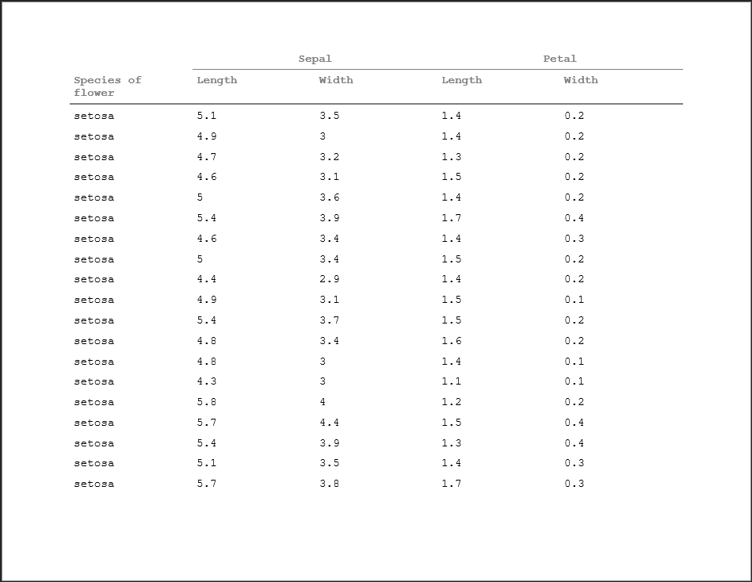

```{r setup, include = FALSE}
knitr::opts_chunk$set(
  collapse = TRUE,
  comment = "#>"
)

library(tidyverse)
library(pharmaRTF)
```

## Introduction

While pharmaRTF can cover your titles, footnotes, and encapsulating document properties - a key feature to creating the tables you need is having a good understand of huxtable. Huxtable has plenty of great user documentation within its own vignettes, available [here](https://hughjonesd.github.io/huxtable/), but within this vignette we will cover some core features necessary to create beautiful tables. 

## Huxtable Basics

Something important to understand about huxtable is that it starts as an abstraction of a data frame. This means that in general, you can index and slice the huxtable object the same way you would with a normal `data.frame` object in R. 

```{r display}
ht <- huxtable::as_hux(iris[, c("Species", "Sepal.Length", "Sepal.Width", "Petal.Length", "Petal.Width")], 
                       add_colnames=TRUE)
ht[1:10, c('Species', 'Petal.Width')]
```

As you can see here, a nice feature of huxtable is that it has a lot of automatic printing options. Within the code of an R markdown file, it automatically outputs as an HTML table. When developing within an R script, it will also print formatted text to your console. This can be very useful for development as you get an idea of how your display will look within the RTF document.

```{r print_screen}
huxtable::print_screen(ht[1:10])
```

## Changing Table Shape

One thing to note is that the default width of a huxtable table will not fill a whole landscape RTF document (when the page size is 11" x 8.5"). A good rule of thumb to follow is that setting the huxtable table width to 1.5 will fill the page properly

```{r set width}
# Assign the attribute
huxtable::width(ht) <- 1.5

# Pipe the attribute
ht <- ht %>% 
  huxtable::set_width(1.5)

ht[1:10]

```

By default, all columns will have an equal width. You can set individual column widths as a ratio of the total width using the `col_width` property functions. Note that you want these values to sum to 1 - if they are less than one, the columns won't fill up the total width of the table

```{r column_widths}
# Assign the attribute
huxtable::col_width(ht) <- c(.4, .15, .15, .15, .15)

# Pipe the attribute
ht <- ht %>% 
  huxtable::set_col_width(c(.4, .15, .15, .15, .15))

ht[1:10]

```

## Column Headers

The `add_colnames` argument inserts the column names into the huxtable table. Something important to understand here is that this argument actually inserts the column names as the first row of the table. Therefore, there are no special properties of the column names compared to other data points within the table:
```{r column names}
ht[1,]
```

This is important to understand, because it actually makes creating column headers very easy in that you don't have to worry about the variable names in the data. Simply create a data frame of the desired column headers and bind it to the data, and then do not use the `add_colnames` argument. 

```{r column names from data frame}
column_headers <- data.frame(
  Species = "Species of Flower",
  Sepal.Length = "Sepal Length",
  Sepal.Width = "Sepal Width",
  Petal.Length = "Petal Length",
  Petal.Width = "Petal Width",
  stringsAsFactors = FALSE
)

ht <- huxtable::as_hux(rbind(column_headers, iris))
ht[1:10]
```
 
Given that the column headers are just another row of the data frame, this also means that you can use multiple rows as your column headers. More on how to take advantage of that later. 

## Cell Formatting

Huxtable supports many different cell formatting properties, including borders, bold, italic, horizontal and vertical alignment, and cell padding. All of these tend to be important when creating outputs in clinical reports. To set a cell property, you simply specify the rows and columns you want to change and apply the property function. When in doubt, consult the documentation to understand the proper values. As with essentially all of the huxtable property functions, there are multiple methods of applying the property to suite your preferred syntax style.

```{r cell formatting}
# Assign attributes directly to object
huxtable::bold(ht[1, ]) <- TRUE
huxtable::italic(ht[2, ]) <- TRUE

# Use piping
ht <- ht %>%
  # Bottom border top row
  huxtable::set_bottom_border(1, 1:ncol(ht), 1) %>% 
  # Thicker bottom border on 2nd row
  huxtable::set_bottom_border(2, 1:ncol(ht), 4) %>% 
  # Align the 3rd row, 2nd column right
  huxtable::set_align(3, 2, 'right') 

ht[1:10]

```

## Cell Merging

Another very useful feature of huxtable is the ability to specify and merge cells. This is done simply by selecting the rows and columns you'd like to merge of the huxtable object. The top left cell's value will take on the value of the merged cells. 

To tie this in with a practical example, think of spanning headers. As mentioned, since column headers are just rows of the huxtable object, we can create spanning headers by creating 2 rows of column headers and merging cells.

```{r spanning header}

# Create the column headers data frame
column_headers <- data.frame(
  Species = c("", "Species of Flower"),
  Sepal.Length = c("Sepal", "Length"),
  Sepal.Width = c("", "Width"),
  Petal.Length = c("Petal", "Length"),
  Petal.Width = c("", "Width"),
  stringsAsFactors = FALSE
)

# Create the huxtable table
ht <- huxtable::as_hux(rbind(column_headers, iris)) %>% 
  # Merge the Sepal cell over the Length and Width
  huxtable::merge_cells(1, 2:3) %>% 
  # Merge the Petal cell over the Length and Width
  huxtable::merge_cells(1, 4:5) %>% 
  # Align the top cells for both Sepal and Petal
  huxtable::set_align(1,2, 'center') %>% 
  huxtable::set_align(1,4, 'center') %>% 
  # Bold all the column header rows
  huxtable::set_bold(1:2, 1:ncol(iris), TRUE) %>% 
  # Bottom border on 1st column header row 
  huxtable::set_bottom_border(1, 2:4, 1) %>% 
  # Bottom border on 2nd row
  huxtable::set_bottom_border(2, 1:ncol(iris), 2)

ht[1:10]
```

## Some Final Notes

Getting your huxtable table right takes some experimentation, and when outputting to RTF it will take multiple iterations to get it right. One very important note is that it's common to have to insert line breaks in your data manually - be it to make your data flow nicely within cells, or to organize column headers properly. Within pharmaRTF, for this you will need to use RTF syntax. Instead of the traditional `\n` - this is just `\line`. But in R, you need to add an extra backslash (`\`) because backslashes are break characters. So to insert a line break in your text, simply add `\\line `. 

A second step that you need to take is to set `escape_contents` to false. This is because by default, huxtable will do some cleaning when generating the output to try to catch certain syntax - and when the RTF generates, the escape character itself has been escaped. The result is that `\line` will appear in your document as text. Fortunately, this is just one extra line of code. 

```{r line breaks}
# Overwrite the column header cell
ht[2, 1] <- "Species of\\line flower"
# Set escape contents to false
huxtable::escape_contents(ht) <- FALSE
# Set display width
huxtable::width(ht) <- 1.5
ht[1:10]

doc <- rtf_doc(ht, header_rows = 2)
write_rtf(doc, file='table4.rtf')
```

And within the RTF output, the lines will display properly. 

```{r table4_img1, out.width = "800px", echo = FALSE}

```

## Further Reading

Be sure to check out our other vignettes!

- To pick up the basics of using pharmaRTF, see [this vignette](pharmaRTF.html)
- To learn more advanced usage of pharmaRTF, see [this vignette](advanced_usage.html)
- To see how to read titles and footnotes from external files, see [this vignette](external_files.html)
