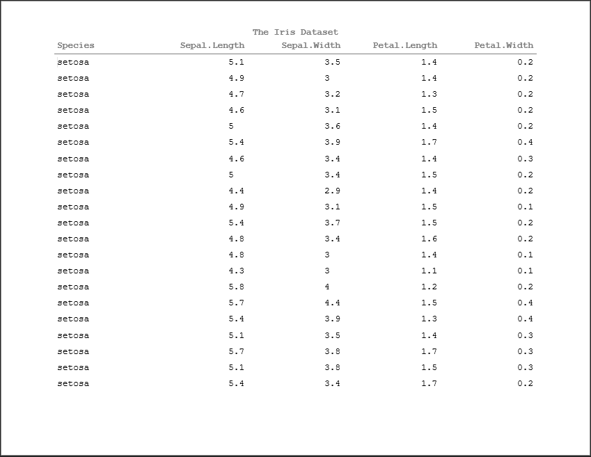
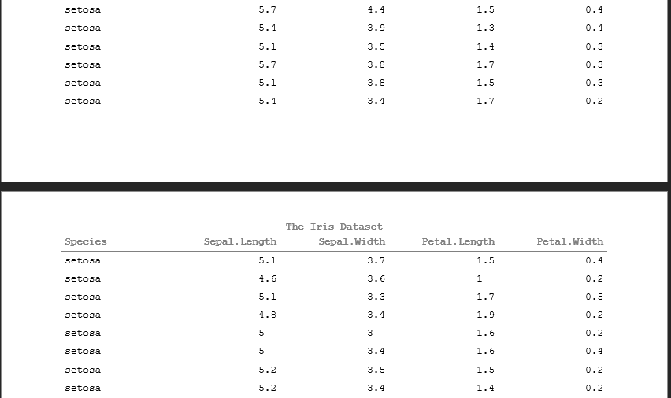
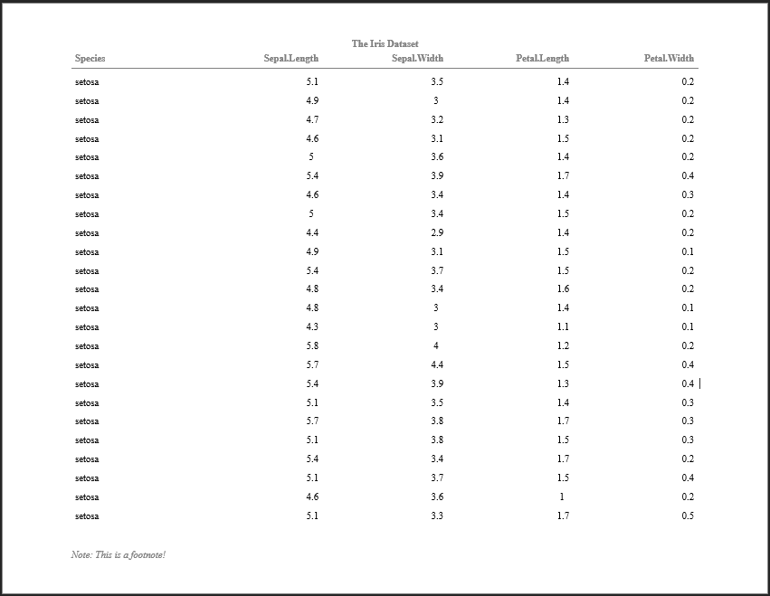

```{r setup, include = FALSE}
knitr::opts_chunk$set(
  collapse = TRUE,
  comment = "#>"
)

library(tidyverse)
library(pharmaRTF)
```

## What is pharmaRTF? 

If you've worked in the pharmaceutical industry as a SAS&copy; programmer doing data analysis for clinical trials, there's a fair chance that you've spent a good amount of time creating RTF outputs. While there are more modern document file formats supported by SAS&copy; and other data analysis languages, RTF remains prolific. Though antiquated, RTF files still remain useful. They support the rich-text format necessary to create documents containing different fonts, colors, and text attributes. Furthermore, RTF documents make it easy for medical writers to insert outputs into different reports and publications as needed. Regardless, outputting data displays to RTF documents is a process embedded in many companies still to this day. 

There are many different table packages available in R. For example, [stargazer](https://cran.r-project.org/package=stargazer) allows you to easily summarize data and create statistical tables in different output formats, such as LaTeX, HTML, ASCII. [kableExtra](https://haozhu233.github.io/kableExtra/awesome_table_in_html.html) lets you build common complex tables and manipulate table styles in HTML outputs. RStudio has been developing [gt](https://github.com/rstudio/gt) which aims to make table creation simple by breaking it into a cohesive set of parts. While there are many more options, few of these support RTF output. 

_Note: gt plans to support RTF in the future, but this functionality is not yet mature._

One library, [huxtable](https://hughjonesd.github.io/huxtable/), does support RTF extensively - with a wide array of styling and formatting options. But there are a few important components missing:

- There are no means to set document properties on an output RTF document, such as page size or orientation
- Column headers cannot repeat from page to page
- While captions can be set, there are no means of creating multi-level titles and multiple footnotes, and captions cannot be inserted into the document header or footer

It's understandable that these gaps exist. R has strong usage in academia, and often these tables are created to be printed in text within a paper, for instance rendered using RMarkdown. The tables we create for a clinical trial are typically positioned within their own section of a CSR independently. 

pharmaRTF was developed to plug this gap without reinventing the wheel. Huxtable offers a powerful table package that can do virtually any styling necessary for the tables we need to create. pharmaRTF consumes a huxtable table and fills in the missing pieces by offering:

- Document property options
- Proper multi-page display
- Titles and footnotes stored within the document headers and footers

_Note: we also plan to support GT tables when the RTF support matures_

## A Small Note

Some of the syntax we use throughout this document uses the `%>%` pipe operator. This is to display support for a tidyverse style of coding. You can find the `%>%` operator in the [magittr](https://cran.r-project.org/package=magrittr/vignettes/magrittr.html) package.

## The Basics

Before you start worrying about creating an RTF document, you first need to create and style your table. For that, use huxtable:

```{r huxtable_code}
dat <- iris %>% 
  select(Species, everything())

ht <- huxtable::as_hux(dat, add_colnames=TRUE) %>% 
  huxtable::set_bold(1, 1:ncol(dat), TRUE) %>% 
  huxtable::set_bottom_border(1, 1:ncol(dat), 1) %>% 
  huxtable::set_width(1.5)
ht[1:10]
```

Now you can create your RTF document. pharmaRTF consists of two different objects:

- `rtf_doc`: the encapsulating object
- `hf_line`: the object used to create titles and footnotes

`rtf_doc` contains document wide attributes, including:

- The default document font and font size
- Document margins
- Orientation
- Header and footer height
- Page size
- Header rows
- Some additional settings for more customization

`hf_line` is used to create titles and footnotes, and contains attributes for each line, including:

- Alignment
- Bold and Italic
- Font (for the individual line)
- Font size (for the individual line)
- Index

There are multiple methods for piecing together an `rtf_doc` object. Within this vignette, we will cover the basics. Let's assume that you want to keep the default document attributes, and you'd like to create a single, bold title of "The Iris Dataset". You could use the following:

```{r table1, eval=FALSE}
doc <- rtf_doc(ht, titles=list(hf_line("The Iris Dataset", bold=TRUE)))

write_rtf(doc, file="table1.rtf")

```

The resulting file looks like:
```{r table1_img1, out.width = "800px", echo = FALSE}

```

The document opens and presents properly as an RTF document within Microsoft Word. Furthermore, the document paging works properly, with titles and column headers repeating pages to page. Note that **the column headers repeat from page to page** - this is because pharmaRTF pulls the column headers out of the huxtable table and into the document header. 

```{r table1_img2, out.width = "800px", echo = FALSE}

```

In the above example, note that we didn't edit any document settings. By default, pharmaRTF will output RTF files with:

- A default font of Courier New
- A default font size of 12
- A default page size of Letter with 11" width and 8.5" height
- Landscape orientation
- 1" margins on all sides
- .5" header and footer heights

All of these attributes can be changed using property functions. For example:

```{r table2, eval = FALSE}
doc <- rtf_doc(ht, titles=list(hf_line("The Iris Dataset", bold=TRUE))) %>% 
  set_pagesize(c(height=5, width=5)) %>% 
  set_font('Times New Roman') %>% 
  set_margins(c(top=2, bottom=2, left=2, right=2)) %>% 
  set_font_size(7)

write_rtf(doc, file="table2.rtf")

```

```{r table2_img1, out.width = "800px", echo = FALSE}
knitr::include_graphics("table2_img1.png")
```


While this display is impractical, it's possible! And customization to all these attributes may be necessary depending on individual circumstances. 

pharmaRTF also offers different interface options depending on your preference. For example, if you don't like piping using `%>%`, other versions of property functions are available. Additionally, titles and footnotes can be attached using the `add_titles` and `add_footnotes` functions.

```{r table3, eval = FALSE}
doc <- rtf_doc(ht)
font(doc) <- 'Times New Roman'
font_size(doc) <- 10
doc <- add_titles(doc, hf_line("The Iris Dataset", bold=TRUE))
doc <- add_footnotes(doc, hf_line("Note: This is a footnote!", italic=TRUE, align='left'))

write_rtf(doc, file="table3.rtf")
```

```{r table3_img1, out.width = "800px", echo = FALSE}

```

## Further Reading

This completes a basic introduction to using pharmaRTF, but there's still more to learn!

- To learn tips and tricks for using huxtable with pharmaRTF, see [this vignette](https://atorus-research.github.io/huxtable_tips.html)
- To learn more advanced usage of pharmaRTF, see [this vignette](https://atorus-research.github.io/advanced_usage.html)
- To see how to read titles and footnotes from external files, see [this vignette](https://atorus-research.github.io/tf_from_file.html)
