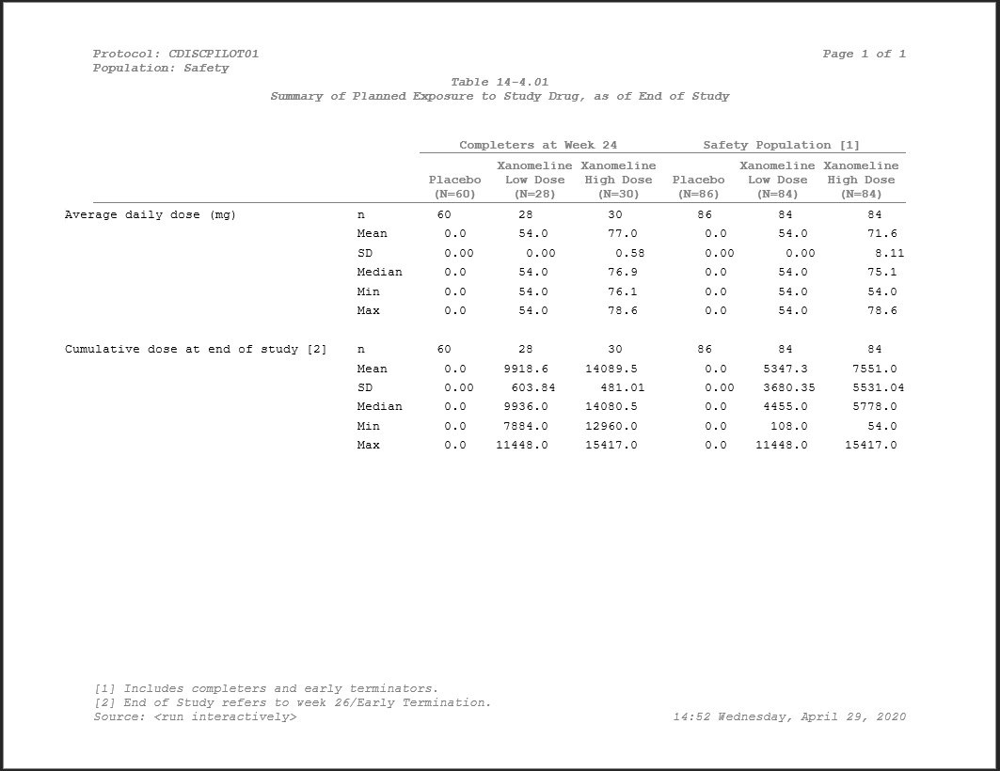

```{r setup, include = FALSE}
knitr::opts_chunk$set(
  collapse = TRUE,
  comment = "#>"
)

library(tidyverse)
library(pharmaRTF)
library(readxl)
```

_We recommend that before reviewing this vignette, you review the [basics of pharmaRTF](https://atorus-research.github.io/pharmaRTF.html) and [the more advanced features](https://atorus-research.github.io/advanced_usage.html)._

## Working pharmaRTF Into Your Process

In this vignette, we will take you through some final features of pharmaRTF to help tie together how this package can centralize titles and footnotes within your organization, and show you the tools you need to embed this into your own internal process.

Being able to specify everything directly in a program is useful. For adhoc tables or to quickly put together an output, keeping everything central and in one spot is nice. But in a mature process, companies typically have a strategy to centralize the assignment of titles and footnotes. Keeping all of your titles and footnotes in one place has many advantages. You can global replace changes that impact numerous outputs. You can keep separate repetitive text instead of repeating it for each table. Updates take place in one file instead of having to open each individual impacted program. In short, centralizing this process is highly desirable within an organization.

pharmaRTF has the tools you need to make this process simple, and this comes from the function `titles_and_footnotes_from_df`. This function allows you to import your titles and footnotes from a data frame. That data frame can either come directly from your R session, or you can build a custom reader function to import the data from an external file. So let's take a look.

## How It Works

The idea behind `titles_and_footnotes_from_df` is simply that there is a set of expectations of what the data looks like that flows into the function. What that data looks like within an external file is irrelevant, as long as it can be transformed to meet the needs of `titles_and_footnotes_from_df` on the way in. This is possible because of the `reader` parameter. The `reader` parameter is just some function that returns a data frame, and that data frame must be compliant with the required variables and types expected by `titles_and_footnotes_from_df`. Those variables, types, and requirements are as follows. 


```{r requirements, echo=FALSE}
requirements <- data.frame(
  Variable = c('type', 'text1', 'text2', 'align', 'bold', 'italic', 'font', 'font_size', 'index'),
  `Column Types`= c('character', 'character', 'character', 'character', 'logical', 'logical', 'character', 'numeric', 'numeric'),
  Required = c('Yes', 'Yes', 'No', 'No', 'No', 'No', 'No', 'No', 'No')
)

knitr::kable(requirements)
```

These variables and types should all look familiar because they're exactly what's required for the object `hf_line`. In fact, `titles_and_footnotes_from_df` simply takes this data and applies the `add_titles` and `add_footnotes` function to the `rtf_doc` object to attach titles and footnotes. 

`type` and `text1` are the only required values and this is because `titles_and_foonotes_from_df` needs to know where to attach the text, and needs to have text to attach. For variables that aren't required, they may be omitted from the data returned by the reader function and the default values from the `hf_line` object will be used.

## Custom Reader Functions

The entire concept behind `titles_and_footnotes_from_df` is allowing the freedom of creating your own process. By allowing the user to pass in a custom reader function to the `reader` parameter, the source of given titles and footnotes can be anything the user wants. You could read from flat text, CSV, Excel, Access, any remote file that R can process and return a data frame meeting the above requirements is on the table.

With this in mind, let's consider a simple example. Assume that I have the excel file `titles.xlsx`. This file looks as follows:

```{r example_file, echo=FALSE}
knitr::kable(read_excel('titles.xlsx'))

```

(For more information about the special text fields you see here, see our [advanced usage](https://atorus-research.github.io/advanced_usage.html) vignette)

Here I have everything I need to generate my titles. I just need to make sure of two things:

- My column types read in appropriately
- When I read the data, I filter to the appropriate table

So overall this will be a pretty simple function. Let's create it.

```{r example_custom_reader}
example_custom_reader <- function(..., table_number=NULL) {

  # If a column isn't populated then the type may be guessed wrong so force it
  col_types <- c('text', 'numeric', 'text', 'text', 'text', 'text', 'logical', 'logical')
  # pass through arguments from ...
  df <- readxl::read_excel(..., col_types=col_types)

  # Subset and return that dataframe
  df[df$table_number==table_number, !names(df) == 'table_number']
}

```

Within a few steps I have everything I need:

- I use `readxl::read_excel` to import the data from the excel file
- I filter the data to just contain rows associated with whatever table I specify
- I remove the `table_number` column and just keep the variables that need to be sent to `titles_and_footnotes_from_df`

Note that here I use the `...` parameter. This is because 

a) the `from.file` parameter is passed forward into the reader function
b) the `...` option on `titles_and_foonotes_from_df` is also passed forward, allowing you to pass whatever arguments necessary from the `titles_and_footnotes_from_df` call into your custom reader. 

With this function now available, let's see what the function returns.

```{r use_custom_Reader}
example_custom_reader('titles.xlsx', table_number = '14-2.01')
```

Here can see the data frame that the function processes and returns. In this example, the data processing was very simple - but in a more advanced case this function could read from multiple sheets, merge in default titles and footnotes, read from different data sources - whatever suits your process.

## Putting It Together

Now with an understanding of how a custom reader function works, let's tie it all together. Let's assume that our table has been programmed, and that the huxtable table is ready in our session (see the [huxtable tips vignette](https://atorus-research.github.io/huxtable_tips.html) to for tips on how to prepare your table). The huxtable table is our session looks like this: 

```{r prep_huxtable, echo=FALSE, results='hide'}
huxtable::as_hux(load('t14_4_01.Rdata'))
```

```{r show_huxtable, echo=FALSE}
ht
```

_Note: The data here comes from the CDISC Pilot, which you can read about [here](https://www.cdisc.org/sdtmadam-pilot-project). Also, see our replication of the tables from this CDISC pilot in our [Github repository](https://github.com/atorus-research/CDISC_pilot_replication)._

Here's how you would go about creating your `rtf_doc` object. (For more information about the functions being used here, see our [advanced usage](https://atorus-research.github.io/advanced_usage.html) vignette)

```{r create_rtfdoc, eval=FALSE}
doc <- rtf_doc(ht, header_rows = 2) %>% titles_and_footnotes_from_df(
  from.file='../data/titles.xlsx',
  reader=example_custom_reader,
  table_number='14-4.01') %>%
  set_column_header_buffer(top=1) %>%
  set_font_size(10)

write_rtf(doc, file="table16.rtf")
```

Within the `titles_and_footnotes_from_df` function you can see the parameters used:

- `from.file` is the location of our titles/footnotes
- `reader` is the function we created within this vignette
- `table_number` is the number of the table we are creating

In the function call, `from.file` and `table_number` are passed forward into the custom reader. From there, validation of the incoming data frame happens, any missing variables have their defaults applied, and then `add_titles` and `add_footnotes` are called on the titles and footnotes within the data respectively. You can see in the resulting table that the titles and footnotes have been applied 

```{r table1_img1, out.width = "800px", echo = FALSE}

```

And there you have it. By using this process, the addition of titles and footnotes to your `rtf_doc` greatly simplifies, and this code becomes very reusable from program to program, allowing you to focus on the nuance of your table creation rather than the redundant application of creating titles and footnotes. As mentioned, it's necessary to be able to manually specify your titles and footnotes as needed - but automating the process of applying them is much more desirable when your studies reach a certain scale. 

## Further Reading

If you have not already reviewed them, be sure to check out our other vignettes

- To pick up the basics of using pharmaRTF, see [this vignette](https://atorus-research.github.io/pharmaRTF.html)
- To learn tips and tricks for using huxtable with pharmaRTF, see [this vignette](https://atorus-research.github.io/huxtable_tips.html)
- To learn more advanced usage of pharmaRTF, see [this vignette](https://atorus-research.github.io/advanced_usage.html)
